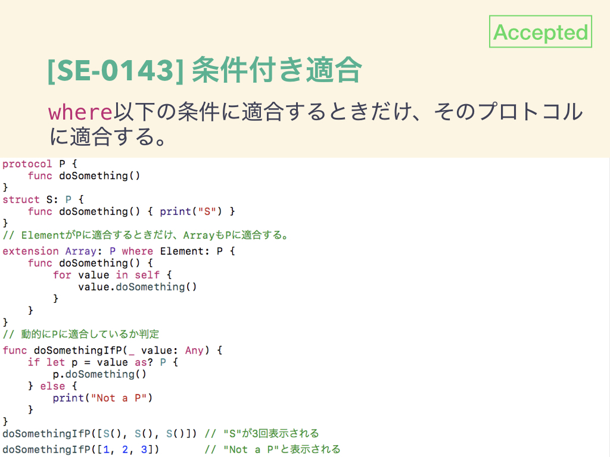
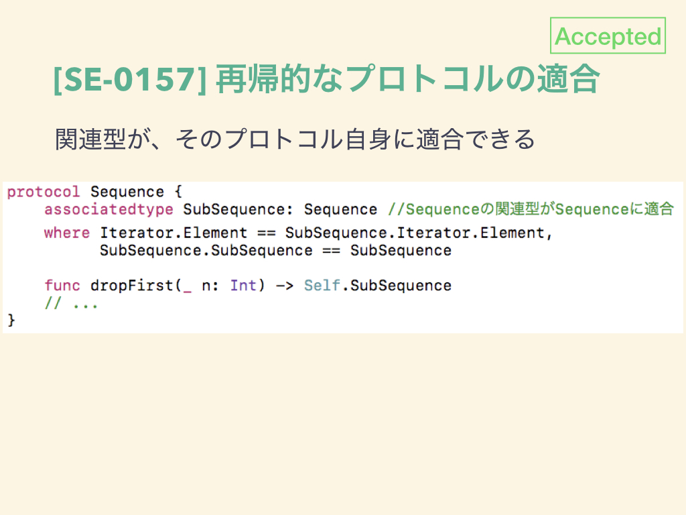
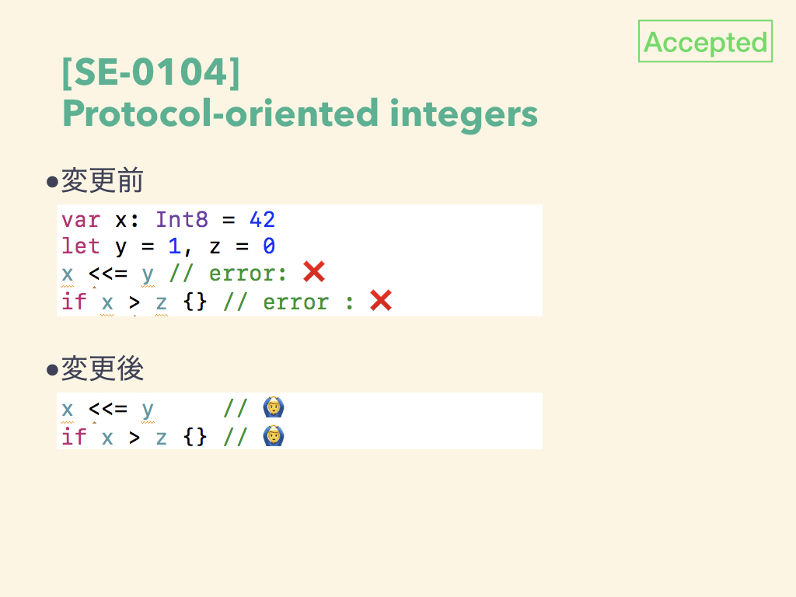
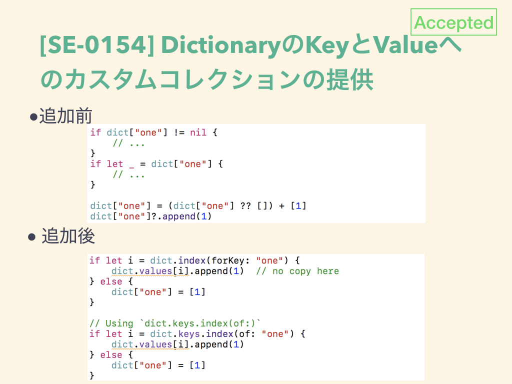
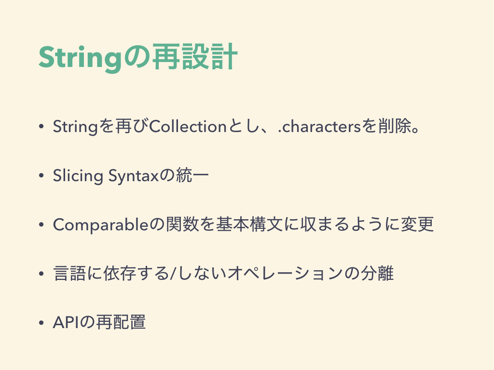
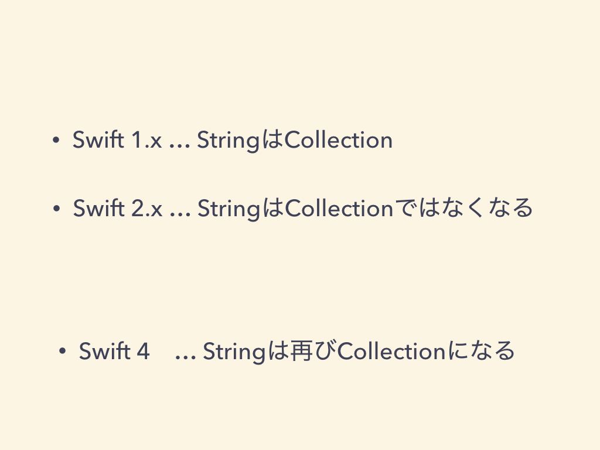
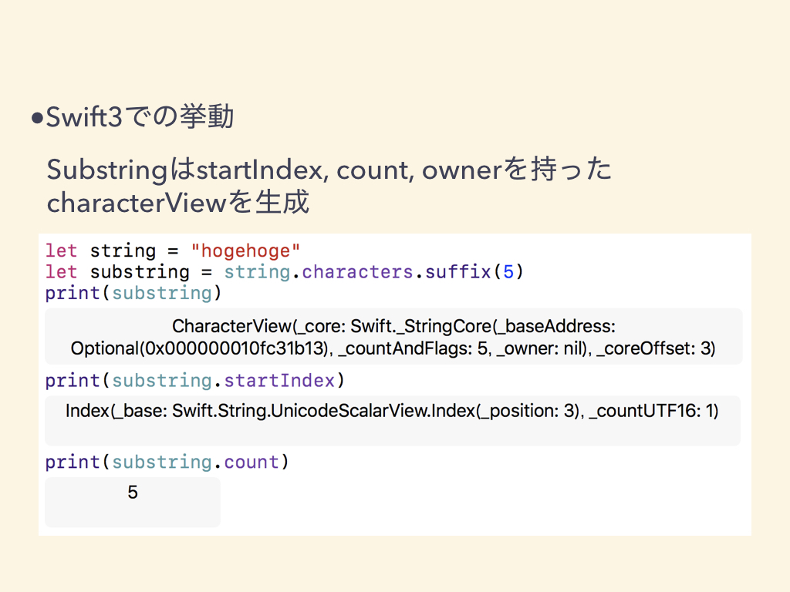
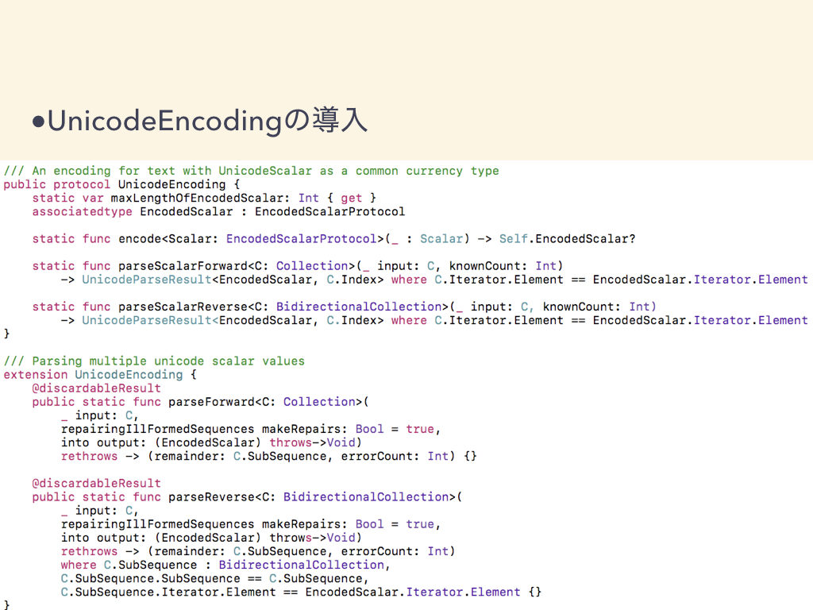
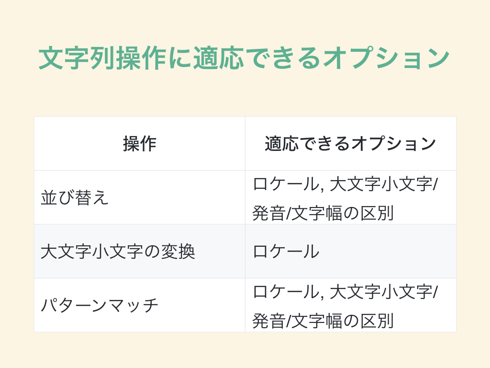
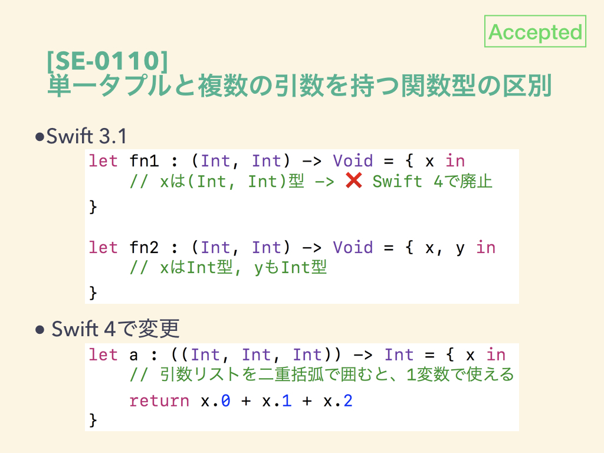

みなさんこんばんは、上手くいっていれば僕は #yidev の懇親会で中華を食べ終わってコーヒー☕でも飲みながらタイムラインを眺めているはずです。コーヒー飲みながら登壇するのは初めてです。自己紹介はプロフィールを見てくださいね。今日はSwift4の話をします。


---

Swift4に関しては、Swift.orgやswift-evolutionで毎日情報が流れていますが、僕自身ちゃんとキャッチアップできていませんでした。今日は出来るだけリソースを提示しながらお話したいと思います。

---

よくわかっている方々には物足りないかもしれませんし、内容を取り違えていたり、深く理解できていない箇所もあるかもしれません。なので、遠慮なくご指摘いただければ幸いです。今回は僕が議題を提供し、みなさんと議論できればとおもいます。さて、早速始めましょう。Swift4が何を目指しているのかはここに記載されています。https://github.com/apple/swift-evolution#development-major-version--swift-40

---

Swift4は今年2017年の下期のリリースを目標に開発が進んでいます。Swift4には２つ目標があります。一つはSwift3のソースコードの安定性の提供、もう一つは、標準ライブラリのABI安定性の提供です。この２つの目標達成のために、開発を2段階に分けています。


---

Stage1: ソー​​ス安定性とABI安定性に必要な基本事項にフォーカスしています。既存の言語機能のABIを根本的に変更しない機能や、標準ライブラリに対するAPIの破壊的な変更を意味する変更は、この段階では考慮していません。Stage1の主だった変更をご紹介します。

---

ソースの安定化：異なるSwiftの言語バージョンが同じソースコードに共存できます。Swift3.1ですでに@ available にSwiftのバージョン指定ができるようになっています。
https://github.com/apple/swift-evolution/blob/master/proposals/0141-available-by-swift-version.md


---

ABIの安定化：コード生成に関して、Swiftランタイムとのやりとりを含めた改善です。SwiftのパフォーマンスやSwiftの今後の方向性に影響することがあります(詳細は後述)。

---

標準ライブラリのジェネリクスの改善：条件付き適合、再帰的なプロトコルの適合、Where節を使った条件付き関連型など、ジェネリクスの機能が強化されます。Genericsに関するプロポーサルを紹介します。Generics Manifestにも記載されています。https://github.com/apple/swift/blob/master/docs/GenericsManifesto.md

---

[SE-0142]関連型が適合するプロトコルにwhere節で条件を付けることができます。


---

[SE-0143]条件付き適合(Conditional Confermance):
特定の条件にマッチしたときだけ、ジェネリクスをそのプロトコルに適合するようにできます。


---

[SE-0157]あるプロトコルの関連型がプロトコル自身に適合できるようになります。例では、先程のwhereを使って条件をつけています。


---

[SE-0148]subscriptに型変数が使えるようになりました。


---

[SE-0104]Genericsの改善とは直接関係しませんが、整数型をプロトコルで再構成して、Generic Programingできるようにします。現在だとこのようにIntとInt8でOperatorの適応はできません。


---

このようなプロトコルで再構成して、Generic Programingを可能にします。各プロトコルの詳細はこちらをご覧ください。
https://github.com/apple/swift-evolution/blob/master/proposals/0104-improved-integers.md


---

Stringの再評価：Swift4では、Unicodeの正確さを維持しながら、よりパワフルで使いやすいStringにしようとしています。今日の後半でも少しStringのお話をします。

---

Memory Ownership Model：CycloneやRustをインスパイアしたモデルになるそうです。これはABIに大きく影響します。Stage1にすべて導入するには巨大過ぎますが、今この段階で設計が必要とのことですが、具体的な話はまだ出てきていない認識です。

---

以上がSwift4 Stage1における変更です。Stage 2に持ち越されるものもありますが、すべてSwift4で実現されるとうれしいですね！🚩。

---

残念なことに、ABIの安定化は延期されました😇 2/16にその旨がメーリスに流れています。コンパイル時間の改善やコンパイラの安定化を優先したということです。
https://lists.swift.org/pipermail/swift-evolution/Week-of-Mon-20170213/032116.html

---

そもそも”ABIの安定化”とはどういうことでしょう。具体的には、ABI Manifestoに書かれています。簡単に言うと、違うバージョンのSwiftでコンパイルされたフレームワークをそのまま使えるぜ！ということです。https://github.com/apple/swift/blob/master/docs/ABIStabilityManifesto.md

---

Swiftのバージョンは統一する必要があるので、Carthageなどで導入したフレームワークは、現状ではVer.upの度にビルドし直す必要があります。ABIの安定化によって、Swiftのバージョンが先に進んでも、古いバージョンのフレームワークはそのまま使えます。

---

このままSwift4がリリースされても、先述のソース安定化によって、同じソースコードにSwift3.xとSwift 4を同居させることは可能です。ですが、Carthageなどで導入しているライブラリがSwift4対応していない場合はどうなるでしょう。

---

どんなに自分のソースコードをSwift4対応しても、フレームワークがSwift4でビルドされていなければコンパイルが通りません。OSS開発者のみなさま、ご対応よろしくお願いします🙏

---

そのままSwift3を使い続けることもできます。Swift4がリリースされると、`-swift-version 3`と`-swift-version 4`の2つのフラグが提供されます。ここに記載があります。https://swift.org/blog/swift-4-0-release-process/

---

Swift Version 3モードは、Swift 4のコンパイラで、Swift3.1のソースコードのビルドが可能になるモードです。ところで今日お集まりのみなさんはSwift3への移行はお済ですよね？

---

Swift Version 4は、Swift 4の破壊的変更を許容します。主に書き換えが必要なのは、String周辺です。Swift2.2からSwift3への変更に比べたらそんなに大したことないとのことですが、実際のところ試してみないとわかりません😇

---

ちなみにStage2で何が変わるのかも見ておきましょう。Stage2ではABIの変更に影響を与えない程度の既存機能の変更が含まれます。


---

ソースの破壊的変更：Swift4モードの破壊的変更です。下記の方針で行われます。破壊的変更は続きますが、swift3モードがあるのでしばらくは大丈夫でしょうか。いつまで延命できるのか気になります。


---

既存の標準ライブラリの改善：コレクションアルゴリズムや、Dictionaryの改善などが含まれます。これに関連するものとして次のプロポーサルを見てみます。

---

[SE-0154] Dictionaryのキーの探索と、mutatingが非効率なので、カスタムコレクションが提供されます。現状ではLazyMapCollectionですが、keysもValueも独自のCollection型になります。



---

Foundationの改善：SwiftではCocoa SDKをシームレスに動作させるために、Foundation APIの改良する予定です。Stage2が開始されると、具体的な目標の詳細が記載されるとのことですが、今日までのところ、その内容は提示されていませんね…

---

以上がStage2の変更内容ですが、つまりまだ明確には定まっていませんし、予定より遅れ気味で進行しています。今まさに議論/開発がなされており、Swiftの成長が身近に感じられて楽しいですね。

---

ここからは、Stringの再評価によって、どのようにAPIが変わるのか見てみましょう。これはString Manifestに記載されています。https://github.com/apple/swift/blob/master/docs/StringManifesto.md

---

Swift 4以降におけるStringが目指しているところは、Perlよりも優れていることらしいです🤔 それが実現するかはともかく、特に改善したいのは、人間工学(Ergonomics)、正確さ(Correctness)、パフォーマンスの３つです。

---

Stringは標準ライブラリやFoundationによって複雑になっています。Stringだけで205個のAPIがあるようです。Intとの比較はジョークみたいなもんです 🤡
https://github.com/apple/swift/blob/master/docs/StringManifesto.md#api-surface-area

---

APIをわかりやすくするために、以下の変更が加わります。


---

1.0では、Collectionでしたが、問題があって2.0で、そうではなくなりました。が、その問題も特に問題じゃなかったから復活させるそうです(本質的ではないので触れません)。とにかくSwift4では再びCollectionになります。
https://github.com/apple/swift/blob/master/docs/StringManifesto.md#string-should-be-a-collection-of-characters-again

---

StringがCollectionになるということは、当然Sequenceにも適合しますので、mapやfilterも使えたりします。部分文字列にスライスすることもできます。

---

そのスライス操作の統一も行うと書いてあります。startIndexとendIndexが明確な場合、subscriptでスライスでき、in-place mutatingもサポートしています。特定のindexからendまで、または最初からindexまでのスライスはメソッドを通して行われ、in-place mutatingはサポートしていません。

```
s[i..<j].mutate() //in-place mutating sがスライスされる
s.prefix(upTo: i).readOnly() // not supported in-place mutating sに影響なし
```

---

スライスすると、SubStringが生成されます。このSubStringの生成方法には3つの選択肢があり、3番を最良と考えているようです。
https://github.com/apple/swift/blob/master/docs/StringManifesto.md#substrings


---

現状では1です。。開始位置、長さ、バッファ所有者を持ったCharacterViewを生成します。効率の良さと引き換えに、Stringが開放されたあともSubStringが生き続けます。他言語ではメモリリークとみなされ、Java1.7からはコピーされます。


---

3はArrayに対するArraySliceのように、StringとSubStringを別の型として扱います。欠点としては、Stringを作ると、SubStringも生成されることですが、SubStringはStringのサブタイプとなり、暗黙的型変換が使えるので、型が違うことも問題にならないと書いてあります。

---

StringとSubStringは別の型という扱いになるので、Unicodeプロトコルの導入も検討されているようです。今日の段階で触れるにはもう少し仕様が変わりそうな気配がしたのでやめておきましょう。

---

国際化の話です。まずlocalizedXXXというメソッドはなくなります。Localeはパラメータとして渡せるようになります。操作に応じて、デフォルトのオプションが変わります。


---

文字列操作に適応できるオプションはこのようになります。この国際化の話もSwift4ではまだ不完全で、Swift5でも議論が続くようですね。https://github.com/apple/swift/blob/master/docs/StringManifesto.md#operations-with-options


---

ここからは現時点でAcceptされたプロポーサル、実装済みのプロポーサルを見てみましょう。※Package Manager関係は今回除外します。また、Swift4で入るかは未定のものも多いです。プロポーサルのステータスはここから。
https://apple.github.io/swift-evolution

---

[SE-0110]タプルの表記について。現在は、タプルとして変数をクロージャで用いる場合も、その要素をそれぞれ変数として扱う場合も、引数に区別ありませんが、Swift4から関数型として宣言する場合は、二重括弧が必要となります。これはSwift4で入ります。


---

[SE-0042]Unapplied Method Referenceです。現在はcurry化されますが、Typeと引数を同じネストで引数となるように変更されます。


---

[SE-0075]Build Configuration Import Testの追加です。canImportでモジュール単位での判定が可能になります。今後OS単位のみでの判定のみでは難しくなるとの判断です。


---

[SE-0153]@NSCopyingの挙動についてです。NSCopyingに準拠したこのようなPersonクラスがあるとします。


---

現状では、@NSCopyingをつけても、initializerでコピーが起こりません。そのせいでディープコピーが起こらず予期せぬ挙動が起こることがあります。


---

期待した挙動を実現するには、現状ではinitializerで.copy()を明示的に呼ぶ必要があります。


---

これはわかりにくいので、@NSCopyingをつけると、常にコピーが起こるように修正されます。


---

[SE-0156]クラスとプロトコルを組み合わせて型を宣言することができます。クラス、サブクラス、プロトコルの組み合わせは5つのルールにもとづいて適用されます。


---

クラスであることはAnyObjectを使って示します。また、クラスとプロトコルを組み合わせることで、そのプロトコルに準拠したクラスのサブクラスであることを示します。


---

プロトコル構成にAnyObjectとClass両方が含まれる場合は、Classが優先されます。Classが2つ含まれる場合、そのクラスは同じ、またはサブクラスである必要があります。サブクラスの場合はスーパクラスをオーバーライドします。


---

プロトコル構成に含まれるtypealiasはプロトコル、クラス、AnyObjectに展開し、ルール1〜4を適応します。


---

[SE-0160]@objcの推論の挙動が変わります。簡単にまとめておくと、dynamicのついたもの、NSObject由来のクラスは従来は@objcをつけなくても@objcとして振る舞いましたが、swift4ではそうではなくなります。


---

プロポーサルにはとても詳しく書いてありますが、ツイートにまとめられなかったので、一昨日potatotipsで先に発表しておきました。資料：https://speakerdeck.com/d_date/se-0160-limiting-at-objc-inference

---

さて、今後のSwiftの変化を駆け巡ってみましたがいかがでしたでしょうか？常にチェックされている方々には少し物足りなかったかもしれません。これまでキャッチアップ出来ていなかった方はこれを気にメーリスで何が議論されているのかぜひ目を通してみてください。

---

英語ですが、Google翻訳の精度が良いと翻訳された日本語もなんとなく読めます。英語を頑張りたいという方にはこういうコミュニティもあります。
https://clem.connpass.com/

---

今回登壇駆動でやってみましたが、内容が内容だけに結構きつかったです😇 消化不良になっている項目がいくつもあります。引き続きキャッチアップを続けるとともに、今後Swiftがどんどん良い言語になっていくことを願ってやみません。以上です。どうもありがとうございました！
